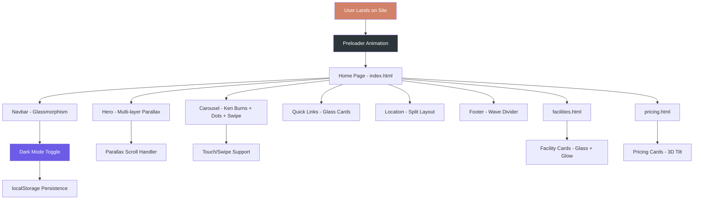

# Ashoka Boys Hostel — Visual Overhaul Plan

## Overview

Transform the existing hostel website from a clean-but-plain design into a modern, visually striking experience using contemporary design trends: glassmorphism, parallax scrolling, dark mode, micro-interactions, and smooth animations. All existing content and structure is preserved; this is purely a visual and experiential upgrade.

---

## Architecture Flow



---

## 1. CSS Custom Properties — Dual Theme System

**File:** [`style.css`](style.css)

Replace the current `:root` block with a dual-theme system using `[data-theme]` attribute.

### Light Theme (default)
- Background: `#FDFBF7` (warm cream)
- Surface: `#FFFFFF` with subtle shadows
- Text: `#2C3539` (deep charcoal)
- Accent: `#D28268` (terracotta) — kept from original

### Dark Theme (`[data-theme="dark"]`)
- Background: `#0F1417` (near-black with warm tint)
- Surface: `#1A2125` with reduced opacity overlays
- Text: `#E8E4DF` (warm off-white)
- Accent: `#E8A87C` (lighter terracotta for contrast)
- Glass: `rgba(26, 33, 37, 0.7)` with `backdrop-filter: blur(20px)`

### Transition
```css
* {
    transition: background-color 0.4s ease, color 0.4s ease, border-color 0.4s ease;
}
```

---

## 2. Navbar — Glassmorphism Redesign

**File:** [`style.css`](style.css) (nav section)

### Visual Specs
- `background: rgba(255, 255, 255, 0.75)` (light) / `rgba(15, 20, 23, 0.75)` (dark)
- `backdrop-filter: blur(20px) saturate(180%)`
- `border-bottom: 1px solid rgba(210, 130, 104, 0.15)`
- Subtle inner glow on scroll: `box-shadow: 0 1px 0 rgba(210, 130, 104, 0.1)`
- Logo gets a gradient text effect: `background: linear-gradient(135deg, #D28268, #BA6C53); -webkit-background-clip: text`

### Dark Mode Toggle
- Add a sun/moon icon button in `nav-right`
- Animated icon rotation on toggle (180deg spin)
- Positioned between phone number and WhatsApp button

---

## 3. Hero Section — Multi-Layer Parallax

**File:** [`index.html`](index.html) + [`style.css`](style.css) + [`script.js`](script.js)

### HTML Changes
Add parallax layers inside hero:
```html
<header class="hero" id="hero">
    <div class="hero-bg-layer" data-parallax="0.3"></div>
    <div class="hero-overlay-layer"></div>
    <div class="hero-content" data-parallax="0.1">...</div>
    <div class="hero-scroll-indicator">...</div>
</header>
```

### CSS
- Hero height: `100vh` with `overflow: hidden`
- `.hero-bg-layer`: fixed background with `transform: translateY(var(--parallax-offset))`
- `.hero-overlay-layer`: gradient overlay `linear-gradient(135deg, rgba(44,53,57,0.7), rgba(44,53,57,0.4))`
- `.hero-scroll-indicator`: animated bouncing chevron at bottom

### JS
- `requestAnimationFrame`-based parallax handler
- Calculates scroll position and applies `--parallax-offset` CSS variable
- Throttled for performance

---

## 4. Carousel Upgrade

**File:** [`index.html`](index.html) + [`style.css`](style.css) + [`script.js`](script.js)

### Additions
- **Dot indicators**: Clickable dots below carousel, active state with terracotta fill
- **Ken Burns effect**: Slow zoom/pan on current slide (`transform: scale(1.05)` over 5s)
- **Swipe support**: Touch event handlers for mobile swipe left/right
- **Pause on hover**: Clear autoplay interval on `.carousel-container:hover`
- **Progress bar**: Thin animated bar at bottom showing time until next slide

### HTML
```html
<div class="carousel-dots">
    <button class="dot active" data-index="0"></button>
    <button class="dot" data-index="1"></button>
    ...
</div>
<div class="carousel-progress">
    <div class="carousel-progress-bar"></div>
</div>
```

---

## 5. Scroll-Triggered Reveal Animations

**File:** [`style.css`](style.css) + [`script.js`](script.js)

### Animation Classes
| Class | Effect |
|-------|--------|
| `.reveal-fade-up` | Fade in + translateY(40px → 0) |
| `.reveal-scale-in` | Scale(0.92 → 1) + fade in |
| `.reveal-slide-left` | translateX(-40px → 0) + fade |
| `.reveal-slide-right` | translateX(40px → 0) + fade |
| `.reveal-stagger > *` | Children animate with 100ms delay increments |

### JS
- Intersection Observer with `threshold: 0.2`
- Adds `.revealed` class when element enters viewport
- Stagger delay calculated via CSS custom property `--stagger-index`

---

## 6. Micro-Interactions

**File:** [`style.css`](style.css)

### Button Ripple Effect
- `::after` pseudo-element with radial-gradient
- On click: scale from 0 to 4, fade out over 600ms
- CSS-only using `:active` state

### Card 3D Tilt
- `transform: perspective(1000px) rotateX(var(--tilt-y)) rotateY(var(--tilt-x))`
- JS mousemove listener calculates tilt based on cursor position within card
- Subtle: max 5deg rotation

### Icon Pulse
- `.icon-wrapper` gets `@keyframes pulse-ring` animation
- Expanding ring on hover using `box-shadow` animation

### Link Underline
- `background: linear-gradient(to right, var(--primary-color), var(--primary-color))`
- `background-size: 0% 2px; background-position: 0% 100%`
- On hover: `background-size: 100% 2px`

---

## 7. Glassmorphism Cards

**File:** [`style.css`](style.css)

### Specs
```css
.glass-card {
    background: rgba(255, 255, 255, 0.6);
    backdrop-filter: blur(16px) saturate(180%);
    border: 1px solid rgba(210, 130, 104, 0.15);
    border-radius: 16px;
    box-shadow: 0 8px 32px rgba(44, 53, 57, 0.08);
}
```

### Gradient Border Variant
```css
.glass-card-gradient {
    position: relative;
    background: rgba(255, 255, 255, 0.6);
    border-radius: 16px;
}
.glass-card-gradient::before {
    content: '';
    position: absolute;
    inset: 0;
    border-radius: 16px;
    padding: 1px;
    background: linear-gradient(135deg, #D28268, #BA6C53, transparent 60%);
    -webkit-mask: linear-gradient(#fff 0 0) content-box, linear-gradient(#fff 0 0);
    mask-composite: exclude;
}
```

### Glow Hover
```css
.glass-card:hover {
    box-shadow: 0 8px 40px rgba(210, 130, 104, 0.2),
                0 0 0 1px rgba(210, 130, 104, 0.3);
    transform: translateY(-6px);
}
```

---

## 8. Floating Back-to-Top Button

**File:** [`index.html`](index.html) + [`style.css`](style.css) + [`script.js`](script.js)

### Design
- Fixed bottom-right, 56px circle
- Glassmorphism style
- SVG progress ring showing scroll percentage
- Appears after scrolling 300px
- Smooth scroll to top on click

### HTML
```html
<button class="back-to-top" id="backToTop" aria-label="Back to top">
    <svg class="progress-ring" width="56" height="56">
        <circle class="progress-ring-bg" ... />
        <circle class="progress-ring-fill" ... />
    </svg>
    <i data-lucide="arrow-up" class="back-to-top-icon"></i>
</button>
```

---

## 9. Footer Redesign

**File:** [`index.html`](index.html) + [`style.css`](style.css)

### Wave Divider
- SVG wave at top of footer: `wave-divider.svg` or inline SVG
- Color matches footer background

### New Structure
```
[Wave Divider]
[3-Column Grid]
  - Brand + Description
  - Quick Links (Home, Facilities, Pricing, Contact)
  - Contact Info (Phone, Address, WhatsApp)
[Newsletter/CTA Bar] — "Ready to elevate your living? Enquire Now →"
[Bottom Bar] — Copyright + Social Icons
```

---

## 10. Preloader Animation

**File:** [`index.html`](index.html) + [`style.css`](style.css) + [`script.js`](script.js)

### Design
- Full-screen overlay with hostel brand color background
- Animated logo/text: "Ashoka" letters fade in sequentially
- Subtle pulsing circle/dot
- Fades out after page load + 500ms delay
- `pointer-events: none` after fade so it doesn't block interaction

### HTML (top of body)
```html
<div class="preloader" id="preloader">
    <div class="preloader-content">
        <span class="preloader-letter" style="--i:0">A</span>
        <span class="preloader-letter" style="--i:1">S</span>
        <span class="preloader-letter" style="--i:2">H</span>
        <span class="preloader-letter" style="--i:3">O</span>
        <span class="preloader-letter" style="--i:4">K</span>
        <span class="preloader-letter" style="--i:5">A</span>
        <div class="preloader-dot"></div>
    </div>
</div>
```

---

## 11. Typography & Spacing System

**File:** [`style.css`](style.css)

### Type Scale (clamp-based)
| Level | Size | Usage |
|-------|------|-------|
| `--text-xs` | `clamp(0.75rem, 1vw, 0.875rem)` | Badges, captions |
| `--text-sm` | `clamp(0.875rem, 1.2vw, 1rem)` | Body small |
| `--text-base` | `clamp(1rem, 1.5vw, 1.125rem)` | Body |
| `--text-lg` | `clamp(1.125rem, 2vw, 1.5rem)` | Lead text |
| `--text-xl` | `clamp(1.5rem, 3vw, 2rem)` | Card titles |
| `--text-2xl` | `clamp(2rem, 4vw, 3rem)` | Section titles |
| `--text-3xl` | `clamp(3rem, 6vw, 4.5rem)` | Hero heading |

### Spacing Scale
`--space-xs: 0.5rem`, `--space-sm: 1rem`, `--space-md: 2rem`, `--space-lg: 4rem`, `--space-xl: 6rem`, `--space-2xl: 8rem`

---

## 12. Dark Mode Toggle (JS)

**File:** [`script.js`](script.js)

### Logic
1. Check `localStorage.getItem('theme')` on load
2. If saved, apply `document.documentElement.setAttribute('data-theme', saved)`
3. If not saved, check `prefers-color-scheme: dark` media query
4. Toggle button swaps theme, saves to localStorage
5. Icon animates: sun rotates out, moon rotates in (or vice versa)

---

## 13. Stats Counter Section (New)

**File:** [`index.html`](index.html) + [`style.css`](style.css) + [`script.js`](script.js)

### Placement
After the carousel section, before quick links.

### Content
| Stat | Value | Label |
|------|-------|-------|
| Rooms | 50+ | Premium Rooms |
| Residents | 200+ | Happy Residents |
| Years | 10+ | Years of Service |
| Rating | 4.8 | Google Rating |

### Animation
- Numbers count up from 0 to target when section enters viewport
- Uses `requestAnimationFrame` with easing
- Duration: ~2 seconds

---

## 14. Cursor Glow Effect (Desktop)

**File:** [`style.css`](style.css) + [`script.js`](script.js)

### Design
- Hidden on mobile (touch devices)
- Large radial gradient circle following cursor
- `pointer-events: none` so it doesn't interfere
- Subtle warm terracotta glow: `radial-gradient(600px at var(--cursor-x) var(--cursor-y), rgba(210,130,104,0.08), transparent 80%)`
- Fixed position overlay on body

---

## 15. Responsive Strategy

**File:** [`style.css`](style.css)

### Breakpoints
- **Mobile**: < 640px — Single column, reduced animations, no cursor glow, no parallax (performance)
- **Tablet**: 640px–1024px — Two-column grids, reduced parallax intensity
- **Desktop**: > 1024px — Full effects, multi-column, cursor glow

### Mobile-Specific
- Glassmorphism still works (backdrop-filter supported on modern mobile)
- Parallax disabled (use `@media (prefers-reduced-motion)` too)
- Carousel swipe is primary navigation
- Dark mode toggle in mobile bottom bar
- Preloader simplified (just logo fade)

---

## File Change Summary

| File | Action | Scope |
|------|--------|-------|
| [`style.css`](style.css) | **Major rewrite** | ~70% new CSS: themes, glassmorphism, animations, new components |
| [`script.js`](script.js) | **Major rewrite** | New: parallax, dark mode, counters, cursor, swipe, preloader, back-to-top |
| [`index.html`](index.html) | **Moderate edits** | Add: preloader, parallax layers, carousel dots, stats section, back-to-top, dark toggle |
| [`facilities.html`](facilities.html) | **Light edits** | Add: glass cards, reveal animations, dark toggle |
| [`pricing.html`](pricing.html) | **Light edits** | Add: 3D tilt cards, reveal animations, dark toggle |

---

## Design Token Reference

```css
/* Light Theme */
--bg-primary: #FDFBF7
--bg-secondary: #F4EFEA
--surface: #FFFFFF
--surface-glass: rgba(255, 255, 255, 0.6)
--text-primary: #2C3539
--text-secondary: #5A636A
--accent: #D28268
--accent-light: #F7EAE3
--accent-dark: #BA6C53
--border: rgba(210, 130, 104, 0.15)
--shadow-sm: 0 2px 8px rgba(44, 53, 57, 0.06)
--shadow-md: 0 8px 32px rgba(44, 53, 57, 0.08)
--shadow-lg: 0 16px 48px rgba(44, 53, 57, 0.12)
--shadow-glow: 0 0 40px rgba(210, 130, 104, 0.15)

/* Dark Theme */
--bg-primary: #0F1417
--bg-secondary: #1A2125
--surface: #1E262B
--surface-glass: rgba(26, 33, 37, 0.7)
--text-primary: #E8E4DF
--text-secondary: #9BA1A6
--accent: #E8A87C
--accent-light: rgba(232, 168, 124, 0.15)
--accent-dark: #D28268
--border: rgba(232, 168, 124, 0.12)
--shadow-sm: 0 2px 8px rgba(0, 0, 0, 0.2)
--shadow-md: 0 8px 32px rgba(0, 0, 0, 0.3)
--shadow-lg: 0 16px 48px rgba(0, 0, 0, 0.4)
--shadow-glow: 0 0 40px rgba(232, 168, 124, 0.1)